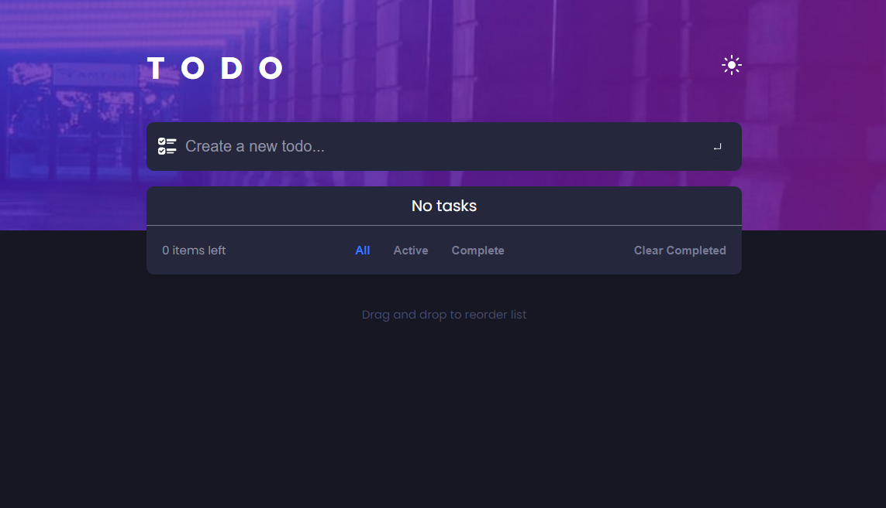

# ToDo List App

## Description

This is a ToDo List app built with React, Redux, Material-UI (MUI), and SCSS. The app allows users to manage their tasks by adding, editing, marking as completed, and deleting tasks. Order and reorder tasks by drag and drop. The app is responsive and works on mobile devices as well as desktops. The app is deployed on Netlify.

## Demo



[Live Demo](https://wanrif-todo.netlify.app/)

## Features

- Add new tasks to the ToDo list.
- Edit existing tasks.
- Mark tasks as completed or uncompleted.
- Delete tasks from the list.
- User-friendly and responsive design with Material-UI components.
- Drag and drop to reorder tasks.

## Installation

To run the app locally, follow these steps:

1. Clone the repository:
```bash
git clone https://github.com/Wansrif/todo-list.git
```

2. Install dependencies:
```bash
yarn
```

3. Start the development server:
```bash
yarn start
```

4. Open your web browser and visit: `http://localhost:3000`

## Technologies Used

- React
- Redux
- Material-UI (MUI)
- SCSS

## Acknowledgements

- Special thanks to the creators of React, Redux, and Material-UI for their awesome libraries.
- Thanks to Netlify for hosting the live demo.